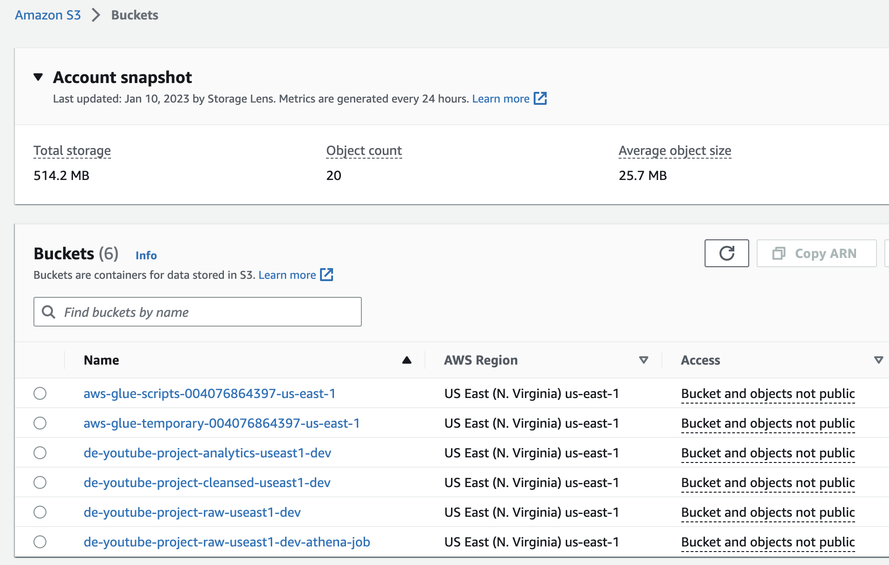
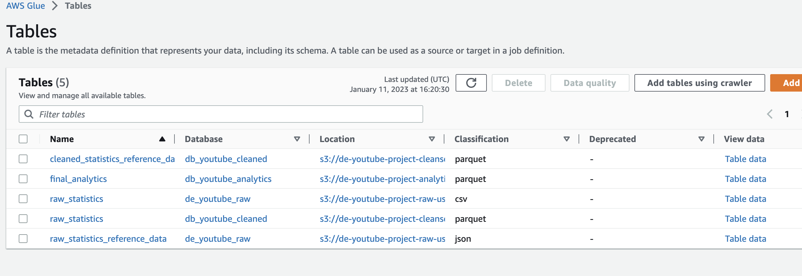
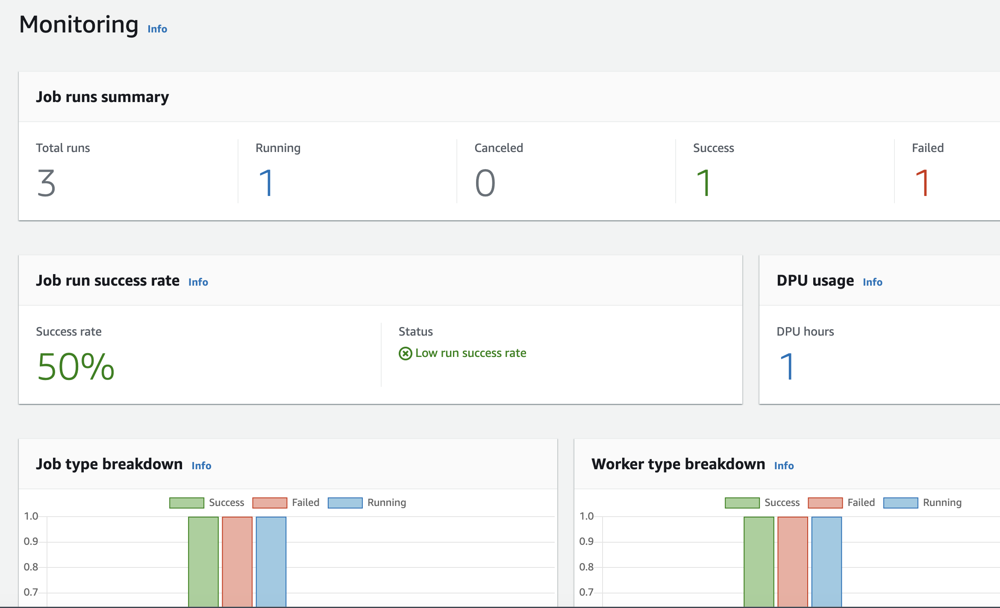

# Youtube Data Engineering and Analytics ETL project done on AWS
This project is about creating an ETL pipeline to analyze the data on trending videos on Youtube. I have done the project in order to enhance my knowledge on the usage of ETL technologies, AWS cloud platform and data analytics
## Data
Data for this project is sourced from the following link: https://www.kaggle.com/datasets/datasnaek/youtube-new?resource=download

YouTube (the world-famous video sharing website) maintains a list of the top trending videos on the platform. According to Variety magazine, “To determine the year’s top-trending videos, YouTube uses a combination of factors including measuring users interactions (number of views, shares, comments and likes). Note that they’re not the most-viewed videos overall for the calendar year”. Top performers on the YouTube trending list are music videos (such as the famously virile “Gangam Style”), celebrity and/or reality TV performances, and the random dude-with-a-camera viral videos that YouTube is well-known for.

## Table of contents
* [General Info](#general-info)
* [Technologies](#technologies)
* [Setup](#setup)

## General Info
The project is entirely done on AWS using the sourced data and uses the AWS technologies such as S3, Glue, Lambda, Athena, Cloudwatch and Quicksight.

In order to use the data, I have created buckets on AWS S3 and have uploaded the raw data as it is. As our data did not contain the information we needed, I have cleaned it using AWS Lambda. The code of the function is given in the repository. Afterwards, I have created a pipeline to transform our data to the format we need and saved it in a different database using AWS Glue Crawlers. 

Preprocessed data was used in another bucket for analytics purposes. I have imported the Glue data to Amazon Quicksight in order to analyze and built a small dashboard. It does not define the entire analytics of the project and can be used for many insights. Besides, in order to automate the pipeline, I have created a trigger on Lambda using Cloudwatch that would allow any JSON file uploaded to S3 to be completed through the data preprocessing pipeline and to be used in later stages. 

Then the analytics S3 bucket was used in cooperation with Quicksight to analyze the data. 

## Technologies
Project is created with:
* AWS IAM
* AWS Lambda
* AWS S3
* AWS Glue
* Amazon Quicksight
* AWS Cloudwatch
* PySpark

## Setup
The project has been created on AWS and screenshots and PDF documents were attached

## Conclusions
The project was useful to understand the working principles of cloud and data engineering technologies and helped me get practical experience. 